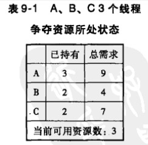
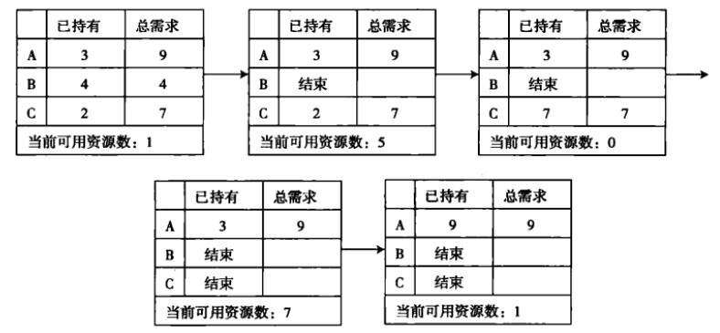

# 死锁
死锁的发生归根结底是因为对资源的竞争。因为大家都想要某种资源，但又不能随心所欲地得到所有资源，在争夺的僵局中，导致任何人无法继续推进。在一个系统里存在多个线程，而这些线程共享该计算机系统里的资源。因为资源竞争而造成系统无法继续推进就难以避免了。这里的资源可以使硬件（CPU、内存、磁盘等），也可以是软件（例如锁、信号量等）。
## 定义与必要条件
- 定义  
如果有一组线程，每个线程都在等待一个事件的发生，而这个事件只能有该线程里面的另一线程发出，则称这组线程发生了死锁。这里的事件主要是资源的释放，在死锁状态中，没有线程可以执行、释放资源或被叫醒。
- 必要条件
    1. 互斥：每个资源要么已经分配给了一个进程，要么就是可用的。
    2. 占有和等待：已经得到了某个资源的进程可以再请求新的资源。
    3. 不可抢占：已经分配给一个进程的资源不能强制性地被抢占，它只能被占有它的进程显式地释放。
    4. 环路等待：有两个或者两个以上的进程组成一条环路，该环路中的每个进程都在等待下一个进程所占有的资源。

## 应对死锁
### 引子：哲学家就餐问题
假设有 5 个哲学家，他们的生活只是思考和吃饭。这些哲学家共用一个圆桌，每位都有一把椅子。在桌子中央有一碗米饭，在桌子上放着 5 根筷子  
  
当一位哲学家思考时，他与其他同事不交流。时而，他会感到饥饿，并试图拿起与他相近的两根筷子（筷子在他和他的左或右邻居之间）。一个哲学家一次只能拿起一根筷子。显然，他不能从其他哲学家手里拿走筷子。当一个饥饿的哲学家同时拥有两根筷子时，他就能吃。在吃完后，他会放下两根筷子，并开始思考。  
哲学家就餐问题是一个经典的同步问题，这不是因为其本身的实际重要性，也不是因为计算机科学家不喜欢哲学家，而是因为它是大量并发控制问题的一个例子。这个代表型的例子满足：在多个进程之间分配多个资源，而且不会出现死锁和饥饿。

### 处理方法
- [鸵鸟策略](#鸵鸟策略)
- [死锁检测与死锁恢复](#死锁检测与死锁恢复)
- [死锁预防](#死锁预防)
- [死锁避免](#死锁避免)

#### 鸵鸟策略
把头埋在沙子里，假装根本没发生问题。

因为解决死锁问题的代价很高，因此鸵鸟策略这种不采取任务措施的方案会获得更高的性能。

当发生死锁时不会对用户造成多大影响，或发生死锁的概率很低，可以采用鸵鸟策略。

大多数操作系统，包括 Unix，Linux 和 Windows，处理死锁问题的办法仅仅是忽略它。

#### 死锁检测与死锁恢复
在死锁检测上，一般会利用到两个矩阵：一个是资源分配矩阵，另一个是资源等待矩阵，如下表所示：
|资源分配矩阵|资源1|资源2|资源3|资源4|资源5|
|:--:|:--:|:--:|:--:|:--:|:--:|
|进程1|-|2|1|3|2|
|进程2|7|-|3|2|5|
|进程3|4|6|-|3|2|
|进程4|3|2|1|-|1|
|进程5|3|5|4|3|-|
----
|资源等待矩阵|资源1|资源2|资源3|资源4|资源5|
|:--:|:--:|:--:|:--:|:--:|:--:|
|进程1|3|2|2|1|0|
|进程2|0|6|1|0|0|
|进程3|0|0|3|1|1|
|进程4|1|1|0|2|1|
|进程5|0|0|0|0|2|
----
此外，还维持两个矢量：一个是系统资源总量矢量（表示系统中所有资源的总数是多少），另一个是系统当前可用资源矢量（代表系统现在还有多少可用的资源），如下表所示：
||资源1|资源2|资源3|资源4|资源5|
|:--:|:--:|:--:|:--:|:--:|:--:|
|系统资源总量|20|20|10|15|10|
----
||资源1|资源2|资源3|资源4|资源5|
|:--:|:--:|:--:|:--:|:--:|:--:|
|可用资源数|3|5|1|4|0|

有了上面的矩阵和矢量，我们就可以通过简单地矩阵运算来判断系统是否发生了死锁。例如，将上图中的资源可用数量矩阵与资源等待矩阵的每一行相减，都会出现负值，那么该系统将要发生死锁。

在死锁恢复上，首先可以抢占（即将某个线程所占有的资源强行拿走，分配给别的线程），其次可以将整个线程Kill杀掉（因为抢占一个线程的资源有可能造成该线程无法再正确运行了），最后则是Rollback回滚（即将整个系统回滚到过去的某个状态，大家从那个状态重新来过）
#### 死锁预防
1. 破坏互斥条件
2. 破坏占有和等待条件
3. 破坏不可抢占条件
4. 破坏环路等待

#### 死锁避免
在每次进行资源分配时，必须经过仔细计算，确保该资源请求批准后系统不会进入死锁或潜在的死锁状态。例如，有一种资源的数量为10个，当前有3个线程正在运行。每个线程需要资源的最大数和当前已经占用的资源数如下表所示：

可以通过以下分配过程得知，存在一个资源分配顺序使得所有线程都能获得其需要的资源，从而得知当前状态是安全状态，不会产生死锁。相反，如果不存在这样一个顺序，那么就有可能产生死锁。

动态避免的优点就是无需等待死锁的发生，而是在死锁有可能发生的时候采取先发制人的措施，断然拒绝有可能进入死锁的资源请求。但是，计算一个状态是否安全并不是一件容易的事情。

- 单个银行家算法  
一个小城镇的银行家，他向一群客户分别承诺了一定的贷款额度，算法要做的是判断对请求的满足是否会进入不安全状态，如果是，就拒绝请求；否则予以分配。
  
上图 c 为不安全状态，因此算法会拒绝之前的请求，从而避免进入图 c 中的状态。

- 多个银行家算法  
  
上图中有五个进程，四个资源。左边的图表示已经分配的资源，右边的图表示还需要分配的资源。最右边的 E、P 以及 A 分别表示：总资源、已分配资源以及可用资源，注意这三个为向量，而不是具体数值，例如 A=(1020)，表示 4 个资源分别还剩下 1/0/2/0。  
检查一个状态是否安全的算法如下：
    - 查找右边的矩阵是否存在一行小于等于向量 A。如果不存在这样的行，那么系统将会发生死锁，状态是不安全的。
    - 假若找到这样一行，将该进程标记为终止，并将其已分配资源加到 A 中。
    - 重复以上两步，直到所有进程都标记为终止，则状态时安全的。  
    
    如果一个状态不是安全的，需要拒绝进入这个状态。