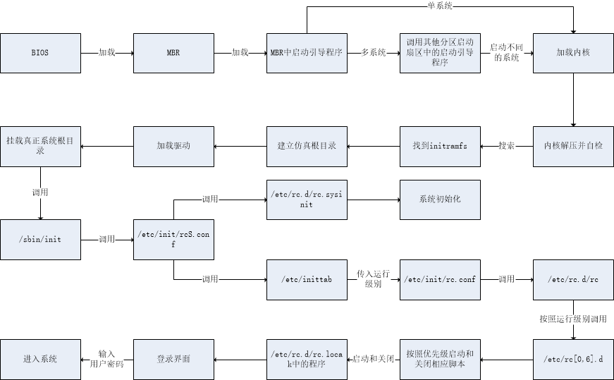

# Linux使用
- [Vim](#vim)
- [程序安装](#程序安装)
- [用户和用户组管理](#用户和用户组管理)
- [权限管理](#权限管理)
- [文件系统](#文件系统)
- [Shell](./Shell.md)
- [服务管理](#服务管理)
- [系统管理](#系统管理)
- [日志管理](#日志管理)
- [启动管理](#启动管理)
- [备份与恢复](#备份与恢复)
- [the-art-of-command-line](https://github.com/jlevy/the-art-of-command-line/blob/master/README-zh.md)
- [命令大全](https://man.linuxde.net/)

# Vim
## 简介
Vim是从 vi 发展出来的一个文本编辑器。代码补全、编译及错误跳转等方便编程的功能特别丰富，在程序员中被广泛使用，和Emacs并列成为类Unix系统用户最喜欢的文本编辑器。  
&ensp;&ensp;&ensp;&ensp;Vim的设计理念是命令的组合。用户学习了各种各样的文本间移动/跳转的命令和其他的普通模式的编辑命令，并且能够灵活组合使用的话，能够比那些没有模式的编辑器更加高效的进行文本编辑。同时VIM与很多快捷键设置和正则表达式类似,可以辅助记忆。并且vim针对程序员做了优化。  


## vim模式
基本上 vi/vim 共分为三种模式，分别是命令模式（Command mode），输入模式（Insert mode）和底线命令模式（Last line mode）。 这三种模式的作用分别是：
- 命令模式：用户刚刚启动 vi/vim，便进入了命令模式。此状态下敲击键盘动作会被Vim识别为命令，而非输入字符。比如我们此时按下i，并不会输入一个字符，i被当作了一个命令。  
以下是常用的几个命令：
    - i 切换到输入模式，以输入字符。
    - x 删除当前光标所在处的字符。
    - : 切换到底线命令模式，以在最底一行输入命令。
    - 若想要编辑文本：启动Vim，进入了命令模式，按下i，切换到输入模式。命令模式只有一些最基本的命令，因此仍要依靠底线命令模式输入更多命令。

- 输入模式：在命令模式下按下i就进入了输入模式。在输入模式中，可以使用以下按键：
    - 字符按键以及Shift组合，输入字符
    - ENTER，回车键，换行
    - BACK SPACE，退格键，删除光标前一个字符
    - DEL，删除键，删除光标后一个字符
    - 方向键，在文本中移动光标
    - HOME/END，移动光标到行首/行尾
    - Page Up/Page Down，上/下翻页
    - Insert，切换光标为输入/替换模式，光标将变成竖线/下划线
    - ESC，退出输入模式，切换到命令模式

- 底线命令模式：在命令模式下按下“:”（英文冒号）就进入了底线命令模式。底线命令模式可以输入单个或多个字符的命令，可用的命令非常多。在底线命令模式中，基本的命令有（已经省略了冒号）：
    - q 退出程序
    - w 保存文件
    - 按ESC键可随时退出底线命令模式。

简单的说，我们可以将这三个模式想成底下的图标来表示：


## 优缺点
- 优点
    - 命令丰富，几乎能满足文本编辑的所有操作
    - 对硬件要求不高
    - 开源，插件丰富
    - 速度快（运行，使用）
- 缺点
    - 学习曲线陡峭，对初学者不友好
    - vim内置脚本语言有局限性，开发效率比不上专业的程序开发软件

#### 常用命令：
- h 或 向左箭头键(←)：光标向左移动一个字符
- j 或 向下箭头键(↓)：光标向下移动一个字符
- k 或 向上箭头键(↑)：光标向上移动一个字符
- l 或 向右箭头键(→)：光标向右移动一个字符
- [Ctrl] + [f]：屏幕『向下』移动一页，相当于 [Page Down]按键 (常用)
- [Ctrl] + [b]：屏幕『向上』移动一页，相当于 [Page Up] 按键 (常用)
- [Ctrl] + [d]：屏幕『向下』移动半页
- [Ctrl] + [u]：屏幕『向上』移动半页
- G：移动到这个档案的最后一行(常用)
- nG：n 为数字。移动到这个档案的第 n 行。例如 20G 则会移动到这个档案的第 20 行(可配合 :set nu)
- gg：移动到这个档案的第一行，相当于 1G 啊！ (常用)
- n<Enter>：n 为数字。光标向下移动 n 行(常用)
- /word：向光标之下寻找一个名称为 word 的字符串。例如要在档案内搜寻 vbird 这个字符串，就输入 /vbird 即可！ (常用)
- ?word：向光标之上寻找一个字符串名称为 word 的字符串。
- n：这个 n 是英文按键。代表重复前一个搜寻的动作。举例来说， 如果刚刚我们执行 /vbird 去向下搜寻 vbird 这个字符串，则按下 n 后，会向下继续搜寻下一个名称为 vbird 的字符串。如果是执行 ?vbird 的话，那么按下 n 则会向上继续搜寻名称为 vbird 的字符串！
- N：这个 N 是英文按键。与 n 刚好相反，为『反向』进行前一个搜寻动作。 例如 /vbird 后，按下 N 则表示『向上』搜寻 vbird 。
- dd：删除游标所在的那一整行(常用)
- ndd：n 为数字。删除光标所在的向下 n 行，例如 20dd 则是删除 20 行 (常用)
- d1G：删除光标所在到第一行的所有数据
- dG：删除光标所在到最后一行的所有数据
- yy：复制游标所在的那一行(常用)
- nyy：n 为数字。复制光标所在的向下 n 行，例如 20yy 则是复制 20 行(常用)
- [Esc]：退出编辑模式，回到一般模式中(常用)
- :w：将编辑的数据写入硬盘档案中(常用)
- :w!：若文件属性为『只读』时，强制写入该档案。不过，到底能不能写入， 还是跟你对该档案的档案权限有关啊！
- :q：离开 vi (常用)
- :q!：若曾修改过档案，又不想储存，使用 ! 为强制离开不储存档案。  
注意一下啊，那个惊叹号 (!) 在 vi 当中，常常具有『强制』的意思～
- :wq：储存后离开，若为 :wq! 则为强制储存后离开 (常用)

# 程序安装
- rpm包安装方式步骤
  1. 找到相应的软件包，比如soft.version.rpm，下载到本机某个目录；
  2. 打开一个终端，su -成root用户；
  3. cd soft.version.rpm所在的目录；
  4. 输入rpm -ivh soft.version.rpm
- deb包安装方式步骤:
  1. 找到相应的软件包，比如soft.version.deb，下载到本机某个目录；
  2. 打开一个终端，su -成root用户；
  3. cd soft.version.deb所在的目录；
  4. 输入dpkg -i soft.version.deb
- tar.gz源代码包安装方式：
  1. 找到相应的软件包，比如soft.tar.gz，下载到本机某个目录；
  2. 打开一个终端，su -成root用户；
  3. cd soft.tar.gz所在的目录；
  4. tar -xzvf soft.tar.gz //一般会生成一个soft目录
  5. cd soft
  6. ./configure
  7. make
  8. make install
- tar.bz2源代码包安装方式：
  1. 找到相应的软件包，比如soft.tar.bz2，下载到本机某个目录；
  2. 打开一个终端，su -成root用户；
  3. cd soft.tar.bz2所在的目录；
  4. tar -xjvf soft.tar.bz2 //一般会生成一个soft目录
  5. cd soft
  6. ./configure
  7. make
  8. make install
- apt方式安装：（安装deb包）
  1. 打开一个终端，su -成root用户；
  2. apt-cache search soft 注：soft是你要找的软件的名称或相关信息
  3. 如果2中找到了软件soft.version，则用apt-get install soft.version命令安装软件
- yum方式安装(安装rpm包)：rpm 是linux的一种软件包名称，以.rmp结尾，安装的时候语法为：rpm -ivh。
rpm包的安装有个很大的缺点就是文件的关联性太大，有时装一个软件要安装很多其他的软件包，很麻烦。
所以为此RedHat小红帽开发了yum安装方法，他可以彻底解决这个关联性的问题，很方便，只要配置两个文件即可安装，安装方法是：yum -y install 。
yum并不是一中包，而是安装包的软件
简单的说： rpm 只能安装已经下载到本地机器上的rpm 包. yum能在线下载并安装rpm包,能更新系统,
且还能自动处理包与包之间的依赖问题,这个是rpm 工具所不具备的。
- bin文件安装：
  1. 打开一个终端，su -成root用户；
  2. chmod +x soft.bin
  3. ./soft.bin //运行这个命令就可以安装软件了
- 不需要安装的软件：有了些软件，比如lumaqq，是不需要安装的，自带jre解压缩后可直接运行。假设下载的是lumaqq.tar.gz，使用方法如下：
  1. 打开一个终端，su -成root用户；
  2. tar -xzvf lumaqq.tar.gz //这一步会生成一个叫LumaQQ的目录
  3. cd LumaQQ
  4. chmod +x lumaqq //设置lumaqq这个程序文件为可运行
  5. 此时就可以运行lumaqq了，用命令./lumaqq即可，但每次运行要输入全路径或切换到刚才生成的LumaQQ目录里
  6. 为了保证不设置路径就可以用，你可以在/bin目录下建立一个lumaqq的链接，用命令ln -s lumaqq /bin/ 即可，以后任何时候打开一个终端输入lumaqq就可以启动QQ聊天软件了
  7.  如果你要想lumaqq有个菜单项，使用菜单编辑工具，比如Alacarte Menu
Editor，找到上面生成的LumaQQ目录里的lumaqq设置一个菜单项就可以了，当然你
也可以直接到 /usr/share/applications目录，按照里面其它*.desktop文件的格
式生成一个自己的desktop文件即可。

# 用户和用户组管理
## 用户管理简介
- 所有越是对服务器安全性要求高的服务器，越需要建立合理的用户权限等级制度和服务器操作规范
- 在Linux中主要是通过用户配置文件来查看和修改用户信息
## /etc/passwd
- 第1字段：用户名称
- 第2字段：密码标志/标识
- 第3字段：UID（用户ID）
    - 0：超级用户
    - 1-499：系统用户（伪用户：不能登入，不能删除）
    - 500-2^32：普通用户
- 第4字段：GID（用户[初始组](#初始组和附加组)ID）
- 第5字段：用户说明
- 第6字段：家目录
    - 超级用户：/root/
    - 普通用户：/home/用户名/
- 第7字段：登陆之后的[Shell](#什么是shell)

## /etc/shadow
- 第1字段：用户名
- 第2字段：加密密码
    - 加密算法为SHA512散列加密算法
    - 如果密码位是"!"或"*"代表没有密码，不能登入
- 第3字段：密码最后一次修改日期
- 第4字段：两次密码修改的间隔时间（和第3字段相比）
- 第5字段：密码有效期（和第3字段相比）
- 第6字段：密码修改到期钱的警告天数（和第5字段相比）
- 第7字段：密码过期后的宽限天数（和第5字段比较）
    - 0：代表密码过期后立即消失
    - -1：代表密码永远不会失效
- 第8字段：账户失效时间
- 第9字段：保留

#### 常用命令
   - 添加用户信息：[useradd](#useradd)
   - 修改用户密码：[passwd](#passwd)
   - 修改用户信息：[usermod](#usermod)
   - 修改用户密码状态：[chage](#chage)
   - 删除用户：userdel [-r] 用户名
   - 切换用户：su [-/-c] 用户名字(只使用"-"代表连带用户的环境变量一起切换)
   - 添加用户组：groupadd [-g GID] 组名
   - 修改组：groupmod [-g GID/-n 新组名] 组名
   - 删除组: groupdel 组名

#### 初始组和附加组
- 初始组：用户一创建就立刻拥有这个用户组的相关权限，每个用户的初始组只能有一个，一般就是和这个用户的用户名相同的组名作为这个用户的初始组
- 附加组：指用户可以加入多个其他的用户组，并拥有这个组的权限，附加组可以有多个
#### 什么是Shell
&ensp;&ensp;&ensp;&ensp;Shell就是Linux的命令解释器。在/etc/password当中，除了标准的Shell是/bin/bash之外，还可以写如/sbin/nologin来禁止普通用户登入
#### useradd
```shell script
[root@localhost ~]# useradd [选项] 用户名
-g：设置默认组
-d：设置默认家目录
-e：设置账户有效日期（yyyy-MM-dd）
例子：
~ useradd kk //添加用户kk
~ useradd -g root kk //添加用户kk，并指定用户所在的组为root用户组
~ useradd -r kk //创建一个系统用户kk
~ useradd-d /home/myf kk //新添加用户kk，其home目录为/home/myf
//当用户名kk登录主机时，系统进入的默认目录为/home/myf
```
#### passwd
```shell script
[root@localhost ~]# passwd [选项] 用户名
-d：删除密码
-f：强迫用户下次登录时必须修改口令
-w：口令要到期提前警告的天数
-k：更新只能发送在过期之后
-l：停止账号使用
-S：显示密码信息
-u：启用已被停止的账户
-x：指定口令最长存活期
-g：修改群组密码
指定口令最短存活期
-i：口令过期后多少天停用账户
例子：
~ passwd kk  //设置runoob用户的密码
Enter new UNIX password:  //输入新密码，输入的密码无回显
Retype new UNIX password:  //确认密码
passwd: password updated successfully

~ passwd -S kk  // 显示账号密码信息
runoob P 05/13/2010 0 99999 7 -1

~ passwd -d ll // 删除用户密码
passwd: password expiry information changed.
```
#### usermod
```shell script
[root@localhost ~]# usermod [选项] 用户名
-u UID：修改用户的UID号
-c 用户说明：修改用户的说明信息
-G 组名：修改用户的附加组
-L：临时锁定用户（Lock）
-U：解锁用户锁定（Unlock）
例子：
~ usermod -d /home/hnlinux kk  // 更改登录目录
~ usermod -u 777 kk  // 改变用户的uid
```
#### chage
```shell script
[root@localhost ~]# chage [选项] 用户名
-l：列出用户的详细密码状态
-d 日期：修改密码最后一次更改日期（shadow 3字段）
-m 天数：两次密码修改间隔（4字段）
-M 天数：密码有效期（5字段）
-W 天数：密码过期前警告天数（6字段）
-I 天数： 密码过后宽限天数（7字段）
-E 日期：账户失效时间（8字段）
例子：
~ chage -l kk   // 查看kk用户以及密码有效期
~ chage -M 60 -m 7 -W 7 kk  // 设置kk用户60天后密码过期，至少7天后才能修改密码，密码过期前7天开始收到告警信息。
~ chage -d 0 kk // 强制用户第一次登陆时修改密码
```
# 权限管理

## ACL权限
&ensp;&ensp;当要给一个用户与文件属主、属组、其他人权限都不相同的时候使用，也就是说，这个用户对于这个文件不属于三种身份的任何一种，是属于第四种身份，那么我们就需要使用ACL权限去给他赋予单独的权限。
## 文件特殊权限
- SetUID/SetGID
    - 只有可以执行的二进制程序才能设定SUID权限
    - 命令执行者要对该程序拥有x（执行）权限
    - 命令执行者在执行该程序时获得该程序文件属主的身份（在执行程序的过程中变为文件的属主）
    - SetUID权限旨在该程序执行过程中有效，程序执行结束后失效
    - 关键目录应严格控制写权限。比如“/”，“/usr”等
    - 对系统中默认应该具有SetUID权限的文件做一列表，定时检查有没有这之外的文件被设置了SetUID权限
- Sticky BIT
    - 粘着位目前只对目录有效
    - 普通用户对该目录拥有w和x权限，即普通用户可以在此目录拥有写入权限
    - 如果没有粘着位，因为普通用户拥有w权限，所以可以删除此目录下所有文件，包括其他用户建立的文件，一旦赋予了粘着位，除了root可以删除所有文件，普通用户就算拥有w权限，也只能删除自己简历的文件，但是不能删除其他用户简历的文件
## 文件系统属性chattr权限： chattr [+-=] [选项] 文件/文件夹
```shell script
[root@localhost ~]# chattr [+-=] [选项] 文件/文件夹
选项
    i:如果对文件设置i属性，那么不允许对文件进行删除、改名，也不能添加和修改数据：如果对目录设置i属性，那么只能修改目录下文件的数据，但不允许建立和删除文件（包括root用户）
    a:如果对文件设置a属性，那么只能在文件中增加数据，但是不能删除也不能修改数据；如果对目录设置a属性，那么只允许在目录中简历和修改文件，但不能删除
```

## 系统命令sudo权限
- sudo权限
    - root把本来只能超级用户执行的命令<b>赋予</b>普通用户执行
    - sudo的操作对象时系统命令
- sudo使用
```shell script
[root@localhost ~]# visudo
# 实际修改的时/etc/sudoers文件

root ALL=(ALL)   ALL
# 用户名 被管理主机的地址=（可使用的身份）  授权命令（绝对路径）
%wheel ALL=(ALL)   ALL
# %组名 被管理主机的地址=（可使用的身份）  授权命令（绝对路径）
# 被管理主机的地址如果是网段：代表如果我将整个网段的ip和服务名和密码都集中在一台服务器，那么配置网段后该用户可以访问这个网段下的所有主机执行授权命令
```

# 文件系统
## 分区和文件系统
- 分区类型
    - 主分区：总共最多分4个
    - 扩展分区：只能有七个，也算作主分区的一种，也就是说主分区加拓展分区最多有四个。但是拓展分区不能储存数据和格式化，必须再划分成逻辑分区才能使用
    - 逻辑分区：逻辑分区是再扩展分区中划分的，如果是IDE硬盘，Linux最多支持59个逻辑分区，如果是SCSI硬盘，Linux最多支持11个逻辑分区（设备名最小从sda5开始，前面4个给主分区和扩展分区使用）


    | 分区名字 |设备文件名 |
    |:-----:|:-----:|
    |主分区1|/dev/sda1|
    |主分区2|/dev/sda2|
    |主分区3|/dev/sda3|
    |扩展分区|/dev/sda4|
    |逻辑分区1|/dev/sda5|
    |逻辑分区2|/dev/sda6|

- 文件系统
    - ext2：是ext文件系统的升级版，Red Hat Linux7.2版本以前的系统默认都是ext2文件系统，1993年发布，最大支持16TB的分区和最大2TB的文件
    - ext3：ext3文件系统是ext2文件系统的升级版本，最大的区别是自带日志功能，以再系统突然停止时提高文件系统的可靠性。最大支持16TB的分区和最大2TB的文件
    - ext4：ext3文件系统的升级版。ext4在性能、伸缩性和可靠性方面进行了大量改进。ext4的变化可以说是天翻地覆的，比如向下兼容ext3、最大1EB文件系统和16TB文件、无线数量子目录、Extents连续数据库概念、多块分配、延迟分配、持久预分配、快速FSCK、日志校验、无日志模式、在线碎片整理、inode增强、默认启用barrier等。是CentOS6.3的默认文件系统

## 文件系统的常用命令
   - df:显示目前在Linux系统上的文件系统的磁盘使用情况统计。df命令是从文件系统考虑的，不光要考虑文件占用的空间，还会统计被命令或程序占用的空间（最常见的就是文件已删除但是程序没有释放空间）
   - du：统计目录或文件大小，命令面向文件。
    ```shell script
    [root@localhost ~]# du [选项] [目录或文件名]
    -a 显示每个子文件的磁盘占用量。默许只统计子目录的磁盘占用量
    -h 使用习惯单位显示磁盘占用量，如KB、MB或GB等
    -s 统计总占用量，而不列出子目录和子文件的占用量
    ```
   - fsck：文件系统修复命令,系统开机执行，底层命令。
   - dumpe2fs：检测磁盘状态
   - mount：挂载Linux系统以外的文件
   - exec：在文件系统中执行可执行文件
   - mkdir：用于建立名称为 dirName 之子目录。
   - fdisk分区、挂载、格式化
  
## 文件系统的一个使用流程
存储介质选择---》硬盘分区操作；创建分区来容纳文件系统；创建分区，这个分区可以是整个硬盘也可以是部分硬盘----》创建文件系统（我们在存储数据之前，你必须使用文件系统对其分区进行格式化）----》把它挂载到虚拟目录----》写入配置文件/etc/fstab

## 硬盘分区的划分标准
硬盘分区由主分区、扩展分区和逻辑分区组成在一块硬盘上，如果是MBR分区方式，那么它的主分区最多只能有4个，或者3个主分区和1个扩展分区；在扩展分区上我们可以创建多个逻辑分区分区编号：主分区1-4 ，逻辑分区5.。。。。。LINUX规定：逻辑分区必须建立在扩展分区之上，而不是建立在主分区上

## 分区作用：
- 主分区：主要是用来启动操作系统的，它主要放的是操作系统的启动或引导程序，/boot分区最好放在主分区上
- 扩展分区不能使用的，它只是做为逻辑分区的容器存在的；我们真正存放数据的是主分区和逻辑分区，大量数据都放在逻辑分区中
- 如果你用的是GPT的分区方式，那么它没有限制主分区个数
- 注意：从MBR转到GPT分区或者说从GPT转到MBR会导致数据全部丢失
- 因此我们在对硬盘分区时最好划分主分区连续，比如说：主分区一、主分区二、扩展分区。

## fdisk用法：
```shell script
[root@localhost ~]# fdisk [选项] <磁盘>    更改分区表
[root@localhost ~]# fdisk [选项] -l <磁盘> 列出分区表
[root@localhost ~]# fdisk -s <分区>        给出分区大小(块数)
选项：
 -b <大小>             扇区大小(512、1024、2048或4096)
 -c[=<模式>]           兼容模式：“dos”或“nondos”(默认)
 -h                    打印此帮助文本
 -u[=<单位>]           显示单位：“cylinders”(柱面)或“sectors”(扇区，默认)
 -v                    打印程序版本
 -C <数字>             指定柱面数
 -H <数字>             指定磁头数
 -S <数字>             指定每个磁道的扇区数
```
## /etc/fstab
- 第1字段：分区设备文件名或UUID（硬盘通过唯一标识码）
- 第2字段：挂载点
- 第3字段：文件系统名称
- 第4字段：挂载参数
- 第5字段：指定分区是否被dump北方，0-不备份，1-每天备份，2-不定期备份
- 第6字段：指定分区是否被fsck检测，0-不检测。其他数字代表检测的优先级，例：1的优先级比2高

## 分配swap分区
   - free命令：查看内存与swap分区使用情况
   - 新建swap分区：使用fdisk分区
   - 格式化：mkswap命令
   - 加入swap分区：swapon命令
   - swap分区开机自动挂载：编辑/etc/fstab文件
     - cached（缓存）：把读取出来的数据保存在内存当中，当每次读取时，不用读取硬盘而直接从内存当中读取，加速了数据的读取过程
     - buffer（缓冲）：写入数据时，先把分散的写入操作保存到内存当中，当达到一定程度在集中写入硬盘，减少了磁盘碎片和硬盘的反复寻道，加速了数据的写入过程

# 服务管理
## 服务的分类

- 启动与自启动
    - 服务启动：就是在当前系统中让服务运行，并提供功能
    - 服务自启动：自启动是指让服务在系统开机或重启之后，随着系统的启动而自动启动服务
- 查询已安装的服务
    - PRM包安装服的服务：
```shell script
[root@localhost ~]# chlconfig --list
# 查看服务自启动状态，可以看到所有RPM包安装的服务
```
    - 源码包安装的服务：查看服务安装位置
- RPM安装服务和源码包安装服务的区别
    - 源码包安装在指定位置，一般是/usr/local/
    - RPM包安装在默认位置
    - /etc/init.d/：启动脚本位置
    - /etc/sysconfig/：初始化环境配置文件位置
    - /etc/：配置文件位置
    - /etc/xinetd.conf：xinetd配置文件
    - /etc/xinetd.d：基于xinetd服务的启动脚本
    - /var/lib/：服务产生的数据
    - /var/log/：日志
## 独立服务管理
- 独立的服务管理
    - 独立服务启动
    1. /etc/init.d/独立服务名 start|stop|status|restart
    2. service 独立服务名 start|stop|status|restart
    - 独立服务的自启动
    1. chkconfig [--level 运行级别] [独立服务名] [on|off]
    2. 修改 /etc/rc.d/rc.local文件
    3. 使用ntsysv命令管理自启动
- 基于xinetd服务的管理:需要先安装xinetd服务先。基于xinetd服务的服务现在越来越少，了解一下就行。

## 源码包服务管理
- 源码包安装服务的启动
    - 使用绝对路径，调用启动脚本来启动。不同的源码包的启动脚本不同。可以查看源码包的安装说明，查看启动脚本的方法
- 源码包服务的自启动：往/etc/rc.d/rc.local文件中加入源码包的启动方式
- 让源码包服务被服务管理命令识别
    - 软连接：将启动脚本连接到/etc/init.d/目录下(ln -s /usr/local/apache2/bin/apachectl /etc/init.d/apache)
    - 让源码包的apache服务能被chkconfig与ntsysv命令管理自启动
    ```shell script
    [root@localhost ~]# vi /etc/init.d/apache
    # chkconfig:35 86 76
    # 制定httpd脚本可以被chkconfig命令管理。格式是：chkconfig:运行级别 启动顺序 关闭顺序，启动顺序和关闭顺序不能和系统现有的服务冲突
    # 启动顺序和关闭顺序不能和系统现有的服务冲突
    # description: source package apache
    # 说明，内容随意
    ```

# 系统管理
## 进程管理
- 进程简介
    - 进程时正在执行的一个程序或者命令，每一个进程都是一个运行的实体，都有自己的地址空间，并占用一定的系统资源
- 进程管理的作用
    - 判断服务器健康状态
    - 查看系统中所有进程
    - 杀死进程
- 查看系统中所有进程
    ```shell script
    [root@localhost ~]# ps aux
    # 查看系统中所有进程，使用BSD操作系统格式
    [root@localhost ~]# ps -le
    # 查看系统中所有进程，使用Linux标准命令格式
    ```
    |Name|作用|
    |:--|:---|
    |USER|该进程是由哪个用户产生的|
    |PID|进程的ID号|
    |%CPU|该进程占用CPU资源百分比|
    |%MEM|该进程占用物理内存的百分比|
    |VSZ|该进程占用虚拟内存的大小，单位时KB|
    |RSS|该进程占用实际物理内存的大小，单位是KB|
    |TTY|该进程时在哪个终端中运行的。其中tty1-tty7代表本地控制台终端，tty1-tty6时本地的字符界面终端,tty7时图形终端.pts/0-256代表虚拟终端|
    |STAT|进程状态。常见的状态有：R-运行、S-睡眠、T-终止状态、s-包含子进程、+-位于后台|
    |START|该进程的启动时间|
    |TIME|该进程占用CPU的运算时间|
    |COMMAND|产生此进程的命令名|
- 查看系统健康状态
```shell script
[root@localhost ~]# top [选项]
选项
-d 秒数： 指定top命令刷新间隔，默认时3秒
? 或 h：显示交互模式的帮助
P：以CPU使用率排序（默认）
M：以内存的使用率排序
N：以PID排序
q：退出top
```
- 终止进程命令
```shell script
[root@localhost ~]# kill -l
# 查看可用的进程信号

[root@localhost ~]# killall [选项][信号] 进程名
# 按照进程名杀死进程
选项
-i：交互式，询问是否要杀死某个进程
-I：忽略进程名大小写

[root@localhost ~]# pkill [信号][信号] 进程名
# 按照进程名终止进程
选项
-t 终端号：按照终端号提出用户
```
|信号代号(常用)|信号名称|说明|
|:--|:--|:--|
|1|SIGHUP|该信号让进程立即关闭，然后重新读取配置文件之后重启|
|2|SIGINT|程序终止信号，用于终止前台进程。相当于输出ctrl+c快捷键|
|8|SIGFPE|在发生致命的算术运算错误时发生，不仅包括浮点运算错误，还包括溢出及除数为0等其他所有的算数错误|
|9|SIGKILL|用来立即结束程序的运行，本信号不能被阻塞、处理和忽略。一般用于强制终止进程|
|14|SIGALRM|时钟定时信号，计算的时实际的时间或时钟时间。alarm函数使用该信号|
|15|SIGTERM|正常结束进程的信号，kill命令的默认信号。有时如果进程已经发生问题，这个信号时无法正常终止进程的，我们才会尝试SIGKILL信号|
|18|SIGCONT|该信号可以让暂停的进程恢复执行，本信号不会被阻断|
|19|SIGSTOP|该信号可以暂停前台进程，相当于输入ctrl+z。本信号不能被阻断|

## 工作管理
- 将程序放入后台执行:命令最后加上"&"
- 查看后台的工作：jobs -l
- 将后台暂停的工作恢复到前台执行：fg 工作号
- 将后台暂停的工作恢复到后台执行：bg 工作号

## 系统资源查看
- 监控系统资源：vmstat [刷新延时， 刷新次数]
- 开机时内核检查信息：dmesg
- 查看内存使用状态：free
- 启动时间和平均负载：uptime
- 查看系统与内核相关信息：uname
- 判断当前系统位数：file /bin/ls
- 查看当前Linux系统的发行版本：lsb_release -a
- 列出进程打开或使用的文件信息：lsof [选项]

## 系统定时任务
- crond服务管理与访问控制
```shell script 
[root@localhost ~]# service crond start
[root@localhost ~]# chkconfig crond on
```
- 用户的crontab设置
```shell script
[root@localhost ~]# crontab [选项]
选项:
-e：编辑crontab定时任务
-l：查询crontab任务
-r：删除当前用户所有的crontab任务
# 进入crontab编辑界面，会打开vim编辑你的工作
* * * * * command 
```
    - 第1个*：分钟
    - 第2个*：小时
    - 第3个*：天
    - 第4个*：月
    - 第5个*：星期几

|时间|含义|
|:--|:--|
|45 22 * * * command|在22点45分执行命令|
|0 17 * * 1 command|每周一的17点0分执行命令|
|0 5 1,15 * * command|每月1号和15号的凌晨5点0分执行命令|
|*/10 4 * * * command|每天凌晨4点，每隔10分钟执行一次命令|
|0 5 * * 1-6 command|周一到周六每天凌晨5点0分执行命令|


# 日志管理
## 日志管理简介
- 在CentOS 6.x中日志服务已经又rsyslogd取代了原先的syslogd服务。rsyslogd日志服务更加先进，功能更多。但是不论该服务的使用，还是日志文件的格式其实都是和syslogd服务相兼容的，所以学习起来基本和 syslogd服务一致。  
rsyslogd的新特点：
    - 基于TCP网络协议传输日志信息
    - 更安全的网络传输方式
    - 有日志消息的及时分析框架
    - 后台数据库
    - 配置文件中可以写简单的逻辑判断
    - 与syslogd配置文件相兼容
- 常见日志的作用：
    |日志文件|说明|
    |:--|:--|
    |/var/log/cron|记录了系统定时任务相关的日志|
    |/var/log/cups/|记录打印信息的日志|
    |/var/log/dmesg|记录了系统在开机时内核自检的信息。也可以使用dmesg命令直接查看内行人自检信息|
    |/var/log/btmp|记录错误登记的日志。这个日志是二进制文件，不能直接vi查看。|
    |/var/log/lastlog|记录系统中所有用户最后一次的登录时间的日志。这个文件也是二进制文件|
    |/var/log/mailog|记录邮件信息|
    |/var/log/message|记录系统重要信息的日志。这个日志文件中会记录Linux系统的绝大多数重要信息，如果系统出现问题时，首先要检查的就应该是这个日志文件|
    |/var/log/secure|记录验证和授权方面的信息，只要涉及账户和密码的程序都会记录，比如说系统的登录，ssh的登录，su切换用户，sudo授权，甚至添加用户和修改用户密码都会记录在这个日志文件中|
    |/var/log/wtmp|永久记录所有用户的登录、注销信息，同时记录系统的启动、重启、关机时间。同样这个文件也是一个二进制文件|
    |/var/log/utmp|记录当前已经登录的用户的信息。这个文件会随着用户的登录和注销而不断变化，只记录当前登录用户的信息。同样这个文件不能直接vi查看|

- 除了系统默认的日志外，采用RPM方式安装的系统服务也会默认把日志记录在/var/log/目录中，不过这些日志不是有rsyslogd服务来记录和管理的，而是各个服务使用自己的日志管理文档来记录自身日志

## rsyslogd日志服务
- 日志文件格式：基础日志格式包裹以下四列
    - 事件产生的时间
    - 发生事件的服务器的主机名
    - 产生事件的服务名和程序名
    - 事件的具体信息
- /etc/rsyslog.com配置文件 
    - 配置：
    ```
    authpriv.*                /var/log/secure
    # 服务名称[连接符号] 日志等级  日志记录位置
    # 认证相关服务，所有日志等级    记录在/var/log/secure日志中
    ```
    - 服务名称说明：
    |服务名称|说明|
    |:--|:--|
    |auth|安全和认证相关消息|
    |authpriv|安全和认证相关消息|
    |cron|系统定时任务cront和at产生的日志|
    |daemon|和各个守护进程相关的日志|
    |ftp|ftp守护进程产生的日志|
    |kern|内核产生的日志|
    |local0-local7|为本地使用预留的服务|
    |lpr|打印产生的日志|

    - 连接符：
    - “*”代表所有日志等级
    - “.”代表只要比后面的等级高（包含），日志都会记录下来
    - “.=”代表只记录所需等级的日志
    - “.!”代表不等于

    -  日志等级：debug、info、notice、warning、err、crit、alert、emerg
    -  日志记录位置
    - 日志文件的绝对路径，如“/var/log/secure”
    - 系统设备文件，如“/dev/lp0
    - 转发给远程主机，如“@192.168.0.1:514”
    - 用户名，如“root”
    - 忽略或丢弃日志，如“～”

## 日志轮替
- 日志文件的命名规则
    - 如果配置文件中拥有“dateext”参数，那么日志会用日期来做日志文件的后缀，例如“secure-20200807”。这样日志文件不会重叠，所以也就不需要日志文件改名，只需要保存制定的日志个数，删除多余的日志文件即可
    - 如果配置文件中没有“dateext”参数，那么日志文件就需要改名了。当第一次进行日志轮替时，当前的“secure”日志会自动改名为“secure.1”，然后新建“secure”日志，用来保存新的日志。
- logrotate配置文件
    |参数|说明|
    |:--|:--|
    |daily|日志轮替周期是每天|
    |weekly|日志轮替周期是每周|
    |monthly|日志轮替周期是每月|
    |rotate 数字|保留的日志文件个数|
    |compress|日志轮替时，旧的日志进行压缩|
    |create mode owner group|建立新日志，同时制定新日志的权限与所有制和所属组|
    |mail address|输出内容通过邮件发送到制定地址|
    |missingok|如果日志不存在，则忽略该日志的警告信息|
    |notifempty|如果日志为空维纳，则不进行日志轮替|
    |minsize 大小|日志轮替的最小值。|
    |size 大小|日志只有大于指定大小才进行日志轮替|
    |dateext|使用日期作为日志轮替文件的后缀|

- 把apache日志加入轮替
    ```shell script
    [root@localhost ~]# vi /etc/logrotate.conf
    /usr/local/apache2/logs/access_log {
    daily
    create
    rotate 30
    }
    ```
- logrotate命令
    ```shell script
    [root@localhost ~]# logrotate [选项] 配置文件名
    选项：
    如果次命令没有选项，会按照配置文件中的条件进行日志轮替
    -v：显示日志轮替过程
    -f：强制进行日志轮替，
    ```

# 启动管理
### 系统运行级别

|运行级别|含义|
|:--|:--|
|0|关机|
|1|单用户模式，可以想象为Windows的安全模式，主要用于系统修复|
|2|不完全的命令行模式，不含NFS服务|
|3|完全的命令行模式，就是标准的字符界面|
|4|系统保留|
|5|图形模式|
|6|重启动|

### 运行级别命令
```shell script
[root@localhost ~]# init 运行级别
# 改变运行级别命令
[root@localhost ~]# runlevel
# 查看运行级别命令
```
## 系统启动过程



### initramfs内存文件系统
  - CentOS 6.x中使用initramfs内存文件系统取代了CentOS 5.x中的initrd RAM Disk。他们的作用类似，可以通过启动引导程序加载到内存中，然后加载启动过程中所需要的内存模型，比如USB、SATA、SCSI硬盘的驱动和LVM、RAID文件系统的驱动
  ```shell script
  # 手动模拟initramfs解压建立仿真根目录
  [root@localhost ~]# mkdir /tmp/initramfs
  # 建立测试目录
  [root@localhost ~]# cp /boot/initramfs-2.6.xxx.img /tmp/initramfs
  [root@localhost ~]# cd /tmp/initramfs
  [root@localhost ~]# file initramfs-2.6.xxx.img
  # 得到时gzip格式的文件
  [root@localhost ~]# mv initramfs-2.6.xxx.img initramfs-2.6.xxx.img.gz
  # 加上后缀
  [root@localhost ~]# gunzip initramfs-2.6.xxx.img.gz
  # 解压
  [root@localhost ~]# file initramfs-2.6.xxx.img.gz
  # 查看解压后的文件格式,得到cpio格式的文件
  [root@localhost ~]# cpio -ivcdu initramfs-2.6.xxx.img.gz
  # 使用cpio解压
  ```
### 调用/etc/init/rcS.conf配置文件
  - 先调用/etc/rc.d/rc.sysinit,然后由/etc/rc.d/rc.sysinit配置文件进行Linux系统初始化
  - 然后再调用/etc/inittab，然后由/etc/inittab配置文件确定系统的默认运行级别
### 调用/etc/rc.d/rc文件
  - 运行级别参数传入/etc/rc.d/rc这个脚本之后，由这个脚本文件按照不同的运行级别启动/etc/rc[0,6].d/目录中的相应的程序
  - /etc/rc3.d/k??开头的文件(??是数字)，会按照数字顺序一次关闭
  - /etc/rc3.d/S??开头的文件(??是数字)，会按照数字顺序一次启动

### 启动引导程序grub
1. Grub配置文件
   - grub中分区表示

    |硬盘|分区|Linux中设备文件名|Grub中设备文件名|
    |:--|:--|:--|:--|
    |第一块SCSI硬盘|第一个主分区|/dev/sda1|hd(0,0)|
    |第一块SCSI硬盘|第二个主分区|/dev/sda2|hd(0,1)|
    |第一块SCSI硬盘|扩展分区|/dev/sda3|hd(0,2)|
    |第一块SCSI硬盘|第一个逻辑分区|/dev/sda5|hd(0,4)|
    |第二块SCSI硬盘|第一个主分区|/dev/sdb1|hd(1,0)|
    |第二块SCSI硬盘|第二个主分区|/dev/sdb2|hd(1,1)|
    |第二块SCSI硬盘|扩展分区|/dev/sdb3|hd(1,2)|
    |第二块SCSI硬盘|第一个逻辑分区|/dev/sdb5|hd(1,4)|

   - grub配置文件

   ```shell script
    [root@localhost ~]# vi /boot/grub/grub.conf
    default=0 
    # 默认启动第一个系统
    timeout=5
    # 等待时间，默认是5秒
    splashimage=(hd0,0)/grub/splash.xpm.gz
    # 这里是指定grub启动时的背景图像文件的保存位置
    hiddenmenu
    # 隐藏菜单
   ```
2. Grub加密与字符界面分辨率调整
   - grub加密
   ```shell script
   [root@localhost ~]# grub-md5-crypt
   # 生成加密码串，然后将密码串加入到grub配置文件中
   ```
   - 纯字符界面分辨率调整
   ```shell script 
   [root@localhost ~]# grep "CONFIG_FRAMEBUFFER_CONSOLE" /boot/config-2.6.xxxx.el6.i686
   # 检查内核是否支持分辨率修改
   # 修改grub配置文件 kernel ..... vga=分辨率
   ```
### 系统修复模式
1. 单用户模式
   - 遗忘root密码
   - 修改系统默认运行级别
2. 光盘修复模式
   - 重要系统文件丢失，导致系统无法启动
   - grub密码遗忘
   - BIOS加密


# 备份与恢复
## 概述
防止发生不可抗因素导致Linux服务器物理节点损毁导致文件的丢失或损坏，进而导致业务的停止，需要将数据信息备份起来，以备不时之需。
- Linux系统中需要备份的数据
    - /root/
    - /home/
    - /var/spool/mail/
    - /etc/
    - 其他目录
- 安装服务的数据
## 备份策略
- 完全备份：完全备份就是指把所有需要备份的数据全部备份，当然完全备份可以备份整块硬盘，这个分区或某个具体的目录
- 增量备份：第一次备份使用完全备份，之后的备份都是备份新增数据（上一次备份到现在的新增数据），每次备份都和上一次备份比较
- 差异备份：第一次备份使用完全备份，第二次备份使用增量备份，第三次备份备份第二次到第三次的所有数据，第四次备份备份第二次到第四次的所有数据...每次备份都和第一次备份比较
#### 常用命令：
- dump命令
```shell script 
[root@localhost ~]# dump [选项] 备份之后的文件名 原文件或目录
选项：
-level：0-9十个备份级别
-f 文件名：指定备份之后的文件名
-u：备份成功之后，把备份时间记录再/etc/dumpdates文件
-v：显示备份过程中更多的输出信息
-j：调用bzlib库压缩备份文件，将备份文件压缩成.bz2格式
-w：显示允许被dump的分区和备份等级及备份时间
例子：
[root@localhost ~]# dump -0uj -f /root/boot.bak.bz2 /boot/
# 执行一次完全备份，压缩备份/boot/目录，更新备份时间
[root@localhost ~]# cat /etc/dumpdates
# 查看备份时间文件
[root@localhost ~]# cp install.log /boot/
# 复制日志文件到/boot分区
[root@localhost ~]# dump -1uj -f /root/boot.bak1.bz2 /boot
# 增量备份到/boot分区。并压缩
[root@localhost ~]# dump -W
# 查询分区的备份时间及备份级别等
```
- restore命令
```shell script
[root@localhost ~]# restore [模式选项] [选项]
选项模式：restore名称常用的模式有以下四种，这四个模式不能混用
-C：比较备份数据和实际数据的变化
-i：进入交互模式，手工选择需要恢复的文件
-t：查看模式，用于查看备份文件中拥有那些数据
-r：还原模式，用于数据还原
选项：
-f：指定备份文件的文件名
例子：
# 还原boot.bak.bz2分区备份
[root@localhost ~]# mkdir boot.test
[root@localhost ~]# cd boot.test/
[root@localhost ~]# restore -r -f /root/boot.bak.bz2
# 先还原完全备份的数据
[root@localhost ~]# restore -r -f /root/boot.bak1.bz2
# 恢复增量备份的数据
```