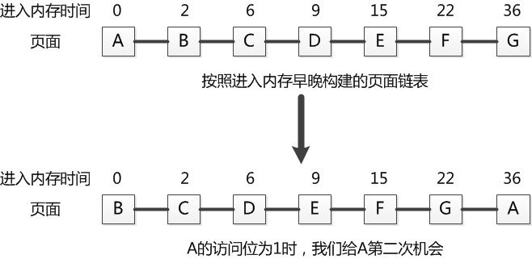
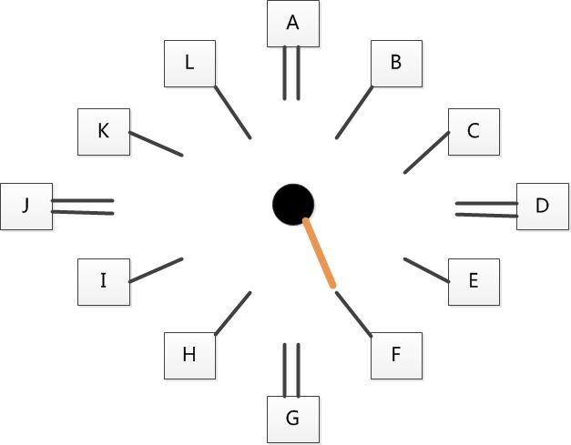
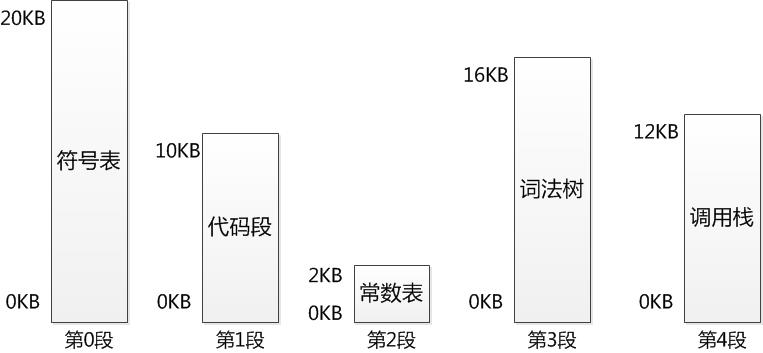
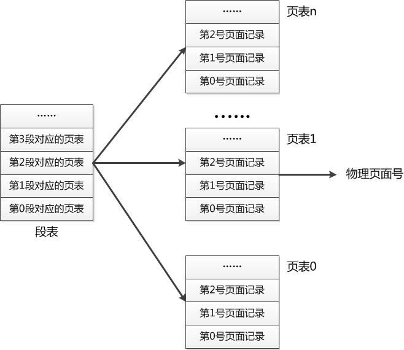

# 内存管理

## 内存管理的目的
1. 地址保护：一个程序不能访问另一个恒旭的地址空间。
2. 地址独立：程序发出的地址应该与物理主存地址无关。  
这两个目标是衡量一个内存管理系统是否完善的标准，它是所有内存管理系统必须提供的基本抽象。

## 虚拟内存  
虚拟内存的目的是为了让物理内存扩充成更大的逻辑内存，从而让程序获得更多的可用内存。  
为了更好的管理内存，操作系统将内存抽象成地址空间。每个程序拥有自己的地址空间，这个地址空间被分割成多个块，每一块称为一页。这些页被映射到物理内存，但不需要映射到连续的物理内存，也不需要所有页都必须在物理内存中。当程序引用到不在物理内存中的页时，由硬件执行必要的映射，将缺失的部分装入物理内存并重新执行失败的指令。  
虚拟内存也有同样的缺点：硬盘的容量比内存大，但也只是相对的，速度却非常缓慢，如果和硬盘之间的数据交换过于频繁，处理速度就会下降，表面上看起来就像卡住了一样，这种现象称为抖动（Thrushing）。相信很多人都有过计算机停止响应的经历，而造成死机的主要原因之一就是抖动。


## 分页系统 
### 交换系统存在的缺陷   
为解决空间浪费和程序大小受限，分页系统横空出世。分页系统的核心在于：将虚拟内存空间和物理内存空间皆划分为大小相同的页面，如4KB、8KB或16KB等，并以页面作为内存空间的最小分配单位，一个程序的一个页面可以存放在任意一个物理页面里。
- 解决空间浪费碎片化问题  
由于将虚拟内存空间和物理内存空间按照某种规定的大小进行分配，这里我们称之为页（Page），然后按照页进行内存分配，也就克服了外部碎片的问题。

- 解决程序大小受限问题  
程序增长有限是因为一个程序需要全部加载到内存才能运行，因此解决的办法就是使得一个程序无须全部加载就可以运行。使用分页也可以解决这个问题，只需将当前需要的页面放在内存里，其他暂时不用的页面放在磁盘上，这样一个程序同时占用内存和磁盘，其增长空间就大大增加了。而且，分页之后，如果一个程序需要更多的空间，给其分配一个新页即可（而无需将程序倒出倒进从而提高空间增长效率）。

### 分页系统地址映射
内存管理单元（MMU）管理着地址空间和物理内存的转换，其中的页表（Page table）存储着页（程序地址空间）和页框（物理内存空间）的映射表。  
对于每个程序，内存管理单元MMU都为其保存一个页表，该页表中存放的是虚拟页面到物理页面的映射。每当为一个虚拟页面寻找到一个物理页面之后，就在页表里增加一条记录来保留该映射关系。
1. 虚拟地址构成：在分页系统下，一个程序发出的虚拟地址由两部分组成：页面号和页内偏移值  

2. 地址翻译(虚拟地址→物理地址)：分页系统的核心是页面的翻译，即从虚拟页面到物理页面的映射（Mapping）。该翻译过程如下伪代码所示：  
    ```
    if(虚拟页面非法、不在内存中或被保护)
    {
        陷入到操作系统错误服务程序
    }
    else
    {
        将虚拟页面号转换为物理页面号
        根据物理页面号产生最终物理地址
    }
    ```
3. 页表：页表的根本功能是提供从虚拟页面到物理页面的映射。

### 优缺点
- 优点：
     1. 分页系统不会产生外部碎片，一个进程占用的内存空间可以不是连续的，并且一个进程的虚拟页面在不需要的时候可以放在磁盘中。
     2. 分页系统可以共享小的地址，即页面共享。只需要在对应给定页面的页表项里做一个相关的记录即可。
- 缺点：
     1. 页表很大，占用了大量的内存空间。
     2. 一个进程只能占有一个虚拟地址空间。在此种限制下，一个程序的大小至多只能和虚拟空间一样大，其所有内容都必须从这个共同的虚拟空间内分配。


## 页面置换算法
在程序运行过程中，如果要访问的页面不在内存中，就会发生缺页终端从而将该页调入内存中。此时如果内存已无空闲空间，系统必须从内存中调出一个页面到磁盘对换区中来腾出空间。  
页面置换算法和缓存淘汰策略类似，可以将内存看成磁盘的缓存。在缓存系统中，缓存的大小有限，当有新的缓存到达时，需要淘汰一部分已经存在的缓存，这样才有空间存放新的缓存数据  
页面置换算法的主要目标是使页面置换频率最低（也可以说缺页率最低）。

1. 最佳(OPT, Optimal replacement algorithm)  
    所选择的被换出的页面将是最长时间内不再被访问，通常可以保证获得最低的缺页率。  
    是一种理论上的算法，因为无法知道一个页面多长时间不再被访问。  
    举例：一个系统为某进程分配了三个物理块，并有如下页面引用序列：  
    7，0，1，2，0，3，0，4，2，3，0，3，2，1，2，0，1，7，0，1  
    开始运行时，先将 7, 0, 1 三个页面装入内存。当进程要访问页面 2 时，产生缺页中断，会将页面 7 换出，因为页面 7 再次被访问的时间最长。

2. 最近最久未使用(LRU, Least Recently Used)  
    虽然无法知道将来要使用的页面情况，但是可以知道过去使用页面的情况。LRU 将最近最久未使用的页面换出。  
    为了实现 LRU，需要在内存中维护一个所有页面的链表。当一个页面被访问时，将这个页面移到链表表头。这样就能保证链表表尾的页面是最近最久未访问的。  
    因为每次访问都需要更新链表，因此这种方式实现的 LRU 代价很高。  
    4，7，0，7，1，0，1，2，1，2，6  
    
3. 最近未使用(NRU, Not Recently Used)  
    每个页面都有两个状态位：R 与 M，当页面被访问时设置页面的 R=1，当页面被修改时设置 M=1。其中 R 位会定时被清零。可以将页面分成以下四类：  
    R=0，M=0  
    R=0，M=1  
    R=1，M=0  
    R=1，M=1  
    当发生缺页中断时，NRU 算法随机地从类编号最小的非空类中挑选一个页面将它换出。  
    NRU 优先换出已经被修改的脏页面（R=0，M=1），而不是被频繁使用的干净页面（R=1，M=0）。
4. 先进先出(FIFO, First In First Out)
    选择换出的页面是最先进入的页面。  
    该算法会将那些经常被访问的页面换出，导致缺页率升高。
5. 第二次机会算法  
    由于FIFO只考虑进入内存的时间，不关心一个页面被访问的频率，从而有可能造成替换掉一个被经常访问的页面而造成效率低下。那么，可以对FIFO进行改进：在使用FIFO更换一个页面时，需要看一下该页面是否在最近被访问过，如果没有被访问过，则替换该页面。反之，如果最近被访问过（通过检查其访问位的取值），则不替换该页面，而是将该页面挂到链表末端，并将该页面进入内存的时间设置为当前时间，并将其访问位清零。这样，对于最近被访问过的页面来说，相当于给了它第二次机会。  
      
    第二次机会算法简单、公平且容易实现。但是，每次给予一个页面第二次机会时，将其移动到链表末端需要耗费时间。此外，页面的访问位只在页面替换进行扫描时才可能清零，所以其时间局域性体现得不好，访问位为1的页面可能是很久以前访问的，时间上的分辨粒度太粗，从而影响页面替换的效果。
6. 时钟  
    为了改善第二次机会算法的缺点，先驱们提出了时钟算法。时钟算法的核心思想是：将页面排成一个时钟的形状，该时钟有一个针臂，每次需要更换页面时，我们从针臂所指的页面开始检查。如果当前页面的访问位为0，即从上次检查到这次，该页面没有被访问过，将该页面替换。反之，就将其访问位清零，并顺时针移动指针到下一个页面。重复这些步骤，直到找到一个访问位为0的页面。  
    例如下图所示的一个时钟，指针指向的页面是F，因此第一个被考虑替换的页面是F。如果页面F的访问位为0，F将被替换。如果F的访问位为1，则F的访问位清零，指针移动到页面G。  
      
    从表面上看，它和第二次机会算法类似，都是访问位为0就更换，反之则再给一次机会。但是，它和第二次机会算法还是有几点不同：  
    - 他们的数据结构不一样，第二次机会使用的是链表，时钟算法使用的是索引（整数指针）。这样，其使用的内存空间不一样。
    - 第二次机会需要使用额外的内存，而时钟算法可以直接使用页表。使用页表的好处是无需额外的空间，更大的好处是页面的访问位会定期自动清零，这样将使得时钟算法的时间分辨粒度较第二次机会算法高，从而取得更好的页面替换效果。  
    
    时钟算法的精髓是第二次机会，其缺点也就和第二次机会算法一样：过于公平，没有考虑到不同页面调用频率的不同，有可能换出不应该或不能换出的页面，还可能造成无限循环。

## 分段
分段管理就是将一个程序按照逻辑单元分成多个程序段，每一个段使用自己单独的虚拟地址空间。例如，对于编译器来说，我们可以给其5个段，占用5个虚拟地址空间，如下图所示：
  
如此，一个段占用一个虚拟地址空间，不会发生空间增长时碰撞到另一个段的问题，从而避免因空间不够而造成编译失败的情况。如果某个数据结构对空间的需求超过整个虚拟之地所能够提供的空间，则编译仍将失败。不过出现这种可能的概率恐怕不会比太阳从西边出来的概率高出多少。

### 优缺点
- 优点：
    1. 每个逻辑单元可单独占用一个虚拟地址空间，这样使得编写程序的空间大为增长。
    2. 由于段式按逻辑关系划分，因此共享起来十分方便。
    3. 对于空间稀疏的程序来说，分段管理将节省大量的空间。
- 缺点：
    1. 外部碎片和一个段必须全部加载到内存。

## 段页式
程序的地址空间划分成多个拥有独立地址空间的段，每个段上的地址空间划分成大小相同的页。这样既拥有分段系统的共享和保护，又拥有分页系统的虚拟内存功能。  
实现采用多级页表，顶级为段表，次级为页表。由段号在段表里面获得所应该使用的页表，然后再该页表里面查找物理的页面号

## 分页与分段的比较
- 对程序员的透明性：分页透明，但是分段需要程序员显式划分每个段。

- 地址空间的维度：分页是一维地址空间，分段是二维的。

- 大小是否可以改变：页的大小不可变，段的大小可以动态改变。

- 出现的原因：分页主要用于实现虚拟内存，从而获得更大的地址空间；分段主要是为了使程序和数据可以被划分为逻辑上独立的地址空间并且有助于共享和保护。