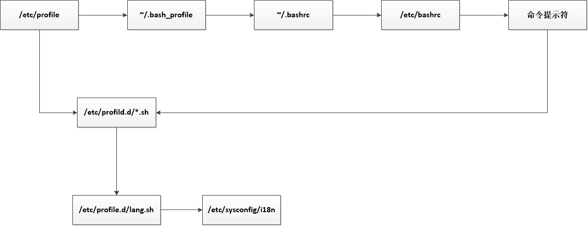

# Shell
  
## 目录
- [概述](#概述)
- [Shell脚本的执行方式](#Shell脚本的执行方式)
- [Bash的基本功能](#Bash的基本功能)
- [Bash的变量](#Bash变量)
- [Bash的运算符](#Bash的运算符)
- [环境变量配置文件](#环境变量)

## 概述
#### Shell简介
- Shell是一个命令行解释器，他为用户提供了一个向Linux内核发送请求以便运行程序的界面系统级程序，用户可以用Shell来来启动、挂起、停止甚至是编写一些程序
- Shell还是一个功能强大的编程语言，易编写，易调试，灵活性强.Shell是解释执行的脚本语言，在Shell中可以直接调用Linxu系统命令


#### Shell分类
- Bourne Shell：从1979起Unix就开始使用Bourne Shell，Bourne Shell的主文件名未sh
- C Shell：C Shell主要在BSD版的Unix系统中使用，其语法和C语言类似而得名
- Shell的两种主要语法类型有Bourne和C。这两种语法彼此不兼容。Bourne家族主要包括sh、ksh、Bash、psh、zsh；C家族主要包括csh、tcsh
- Bash：Bash与sh兼容，现在使用的Linux就是使用Bash作为用户的基础Shell

#### Linux中支持的Shell：查看文件 /etc/shells

## Shell脚本的执行方式

#### echo输出命令
```shell script
# echo [选项] [输出内容]
-e：支持反斜线控制的字符转换
```

#### 第一个脚本
````shell script
# vi hello.sh
#!/bin/bash     // 标称我写的脚本是shell脚本
echo -e 'Hello, World!'

# chmod u+x hello.sh
# ./hello.sh
````

#### 脚本执行
- 赋予执行权限，直接运行：chmod u+x shell.sh
- 通过Bash调用执行脚本：bash shell.sh

## Bash的基本功能
#### 历史命令与命令补全
###### 历史命令：默认保存1000条，可以在环境变量配置文件/etc/profile中进行修改
```shell script
# history [选项] [历史命令保存文件]
-c 清空历史命令缓存
-w 把缓存中的历史命令写入历史命令包文件中
```
###### 历史命令调用
- 使用上、下箭头调用以前的历史命令
- 使用“!n”重复执行第n条历史命令
- 使用“!!”重复执行上一条命令
- 使用“!字符串”重复执行最后一条以该字符串开头的命令
 
###### 命令与文件补全：在Bash中，命令与文件补全是非常方便与常用的功能，我们只要在输入命令或文件时，按“Tab”键就会自动进行补全
 
#### 命令别名与常用快捷键
###### 命令别名:重启后会失效
```shell script
# alias 别名='原命令'
例子:
# alias ll=ls -l
# alias vi=vim
# alias rmf=rm -f

# alias
# 查询命令别名

# unlias
# 删除别名
```
###### 命令执行时顺序
1. 第一顺位执行用绝对路径或相对路径的命令
2. 第二顺位执行别名
3. 第三顺位执行Bash的内部命令
4. 第四顺位执行按照$PATH环境变量定义的目录查找顺序找到的第一个命令

###### 让别名永久生效
```shell script
# vi /root/.bashrc
```

###### Bash常用快捷键

|  快捷键 | 作用 |
|:-----|:-----|
|ctrl + A |  把光标移动到命令行开头  |
|ctrl + E |  把光标移动到命令行结尾  |
|ctrl + C |  强制终止当前的命令  |
|ctrl + L |  清屏，相当于clean命令  |
|ctrl + U |  删除或剪切光标之前的内容。  |
|ctrl + K |  删除或剪切光标之后的内容  |
|ctrl + Y |  黏贴ctrl+U或ctrl+K剪切的内容  |
|ctrl + R |  在历史命令中搜索，按下ctrl+R之后，就会出现搜索界面，只要输入搜索内容，就会从历史命令中搜索  |
|ctrl + D |  退出当前终端  |
|ctrl + Z |  暂停。并放入后台。  |
|ctrl + S |  暂停屏幕输出  |
|ctrl + Q |  恢复屏幕输出  |
 
#### 输入输出重定向
###### 标准输入输出
|  设备 | 设备文件名 | 文件描述符 | 类型 |
|:-----:|:-----:|:-----:|:-----:|
|键盘|/dev/stdin |0|标准输入|
|显示器|/dev/sdtout |1|标准输出|
|显示器|/dev/sdterr |2|标准错误输出|

######输出重定向1：缺点时要人为判断命令是否正确
|  类型 | 符号 | 作用 |
|:-----:|:-----:|:-----:|
|标准输出重定向|命令 [>/>>] 文件|以[覆盖/追加]的方式，把命令的正确输出输出到指定的文件或者设备当中|
|标准错误输出重定向|错误命令 2 [>/>>] 文件|以[覆盖/追加]的方式，把命令的错误输出输出到指定的文件或者设备当中|

######输出重定向2：正确输出和错误输出同时保存
| 符号 | 作用 |
|:-----:|:-----:|
|命令 > 文件 2>&1|以覆盖的方式，把正确输出和错误输出都保存在同一文件中|
|命令 >> 文件 2>&1|以追加的方式，把正确输出和错误输出都保存在同一文件中|
|命令 &> 文件|以覆盖的方式，把正确输出和错误输出都保存在同一文件中|
|命令 &>> 文件|以追加的方式，把正确输出和错误输出都保存在同一文件中|
|命令 >> 文件 1 2>>文件2|把正确的输出追加到文件1中，把错误的追加到文件2中|

###### 输入重定向
```shell script
# wc [选项] [文件名]
-c 统计字节数
-w 统计单词数
-l 统计行数
```

#### 多命令顺序执行与管道符
###### 多命令顺序执行
| 多命令执行符 | 格式 | 作用 |
|:-----:|:-----:|:-----:|
|;|命令1 ; 命令2|多个命令顺序执行，命令之间没有任何逻辑关系|
|&&|命令1 && 命令2|逻辑与，当命令1执行成功后，命令2才会执行；当命令1执行不正确，则命令2不会执行|
|II|命令1 II 命令2|逻辑或，当命令1执行不正确，命令2才会执行；当命令1正确执行，则命令2不会执行|
```shell script
例子
# ls;date;cd /root
# ls anaconda-ks.cfg && echo yes
# ls /root/test || echo 'no'
# 命令 && echo yes || echo no
```

###### 管道符
````shell script
# 命令1 | 命令2  // 命令1的正确输出作为命令2的操作对象
# netstat -tpnl | grep 8080
````
#### 通配符与其他特殊符号
###### 通配符
| 通配符 | 作用 |
|:-----:|:-----:|
|?|匹配<b>一个</b>任意字符|
|*|匹配0个或者任意多个任意字符，也就是可以匹配任何内容|
|[]|匹配中括号中任意一个字符，例如：[abc]代表一定匹配一个字符，或者a，或者b，或者c|
|[-]|匹配中括号中任意一个字符，-代表一个范围，例如[a-z]代表匹配一个小写字母|
|[^]|逻辑非，代表匹配不是中括号内的一个字符。例如：[^0-9]代表匹配不是数字的字符|

###### Bash中其他特殊符号
| 通配符 | 作用 |
|:-----:|:-----|
|''|单引号。在单引号中所有的特殊符号，入“$”、“`”、“!”等都没有特殊含义|
|""|双引号。在双引号中特殊符号都没有特殊含义，但是“$”, “`”和“\”是例外，拥有“调用变量的值”、“引用命令”和“转义符”的特殊含义|
|``|反引号。反引号括起来的内容是系统命令，在Bash中会先执行它。和$()作用一样，不过推荐是使用$()，应为反引号非常容易看错|
|$()|和反引号作用一样|
|#|在Shell脚本中，#开头的行代表注释|
|$|用于调用变量的值，如需要调用变量name的值时，需要用$name的方式得到变量的值|
|\|转义符，跟在\之后的特殊符号将失去特殊航医，变为普通字符，如\$将输出“$”符号，而不是当作变量引用|

## Bash变量
#### 用户自定义变量
1. 什么是变量
    - 变量是计算机内存的单元，其中存放的值可以改变。当Shell脚本需要保存一些信息时，如果一个文件名或是一个数字，就把它存放在一个变量中。每个变量有一个名字，所以很容易引用它。使用变量可以保存有用信息，使系统获知用户相关设置，便改良也可以用于保存暂时信息。
2. 变量设置规则
    - 变量名称可以由字母、数字和下划线组成，但是不能以数字开头。如果变量名是“2name”则是错误的 
    - 在Bash中，变量的默认类型都是字符串类型，如果要进行数值运算，则必须指定变量类型未数值类型
    - 变量用等号连接值，等号左右两侧不能有空格
    - 变量的值如果有空格，则需要使用单引号或双引号包括起来
    - 在变量的值中，可以使用“\”转义符
    - 如果需要增加变量的值，那么可以进行变量值的叠加。不过变量需要用双引号包含起“$变量名”或用${变量名}包含
    - 如果是把命令的结果作为变量值赋予变量，则需要使用反引号或$()包含命令
    - 环境变量名建议大写，便于区分
3. 变量分类
    - 用户自定义变量
    - 环境变量：这种变量主要保存的是和系统操作环境相关的数据
    - 位置参数变量：这种变量主要是用来向脚本当中传递参数或数据的，变量名不能自定义，变量作用是固定的
    - 预定义变量：是Bash中已经定义好的变量，变量名不能自定义，变量作用也是固定的  
4. 本地变量
    - 变量定义
    ```shell script
   # s="Hello world." 
   # echo $s 
    ```  
   - 变量叠加
   ```shell script
   # a=123
   # a="$aa"456
   # a=${aa}789
   # echo $a
    ```
   - 变量调用：echo
   - 变量查看：set
   - 变量删除：unset [变量名]


#### 环境变量
1. 环境变量是什么  
&ensp;&ensp;用户自定义变量只是当前的Shell中生效，而环境变量会在当前Shell和这个Shell的所有子Shell当中生效。如果把环境变量写入相应的配置文件，那么这个环境变量就会在所有的Shell中生效
2. 设置环境变量
    ```shell script
   # export 变量名=变量值   // 设置环境变量
   # env   // 查询变量
   # unset 变量名   // 删除变量
    ```
3. 系统常见的环境变量
    - PATH：系统查找命令的路径
    - PS1：定义系统提示符的变量
    ```shell script
   [root@localhost ~]# PS1='[\u@\t \w]\$'
   [root@04:50:08 /usr/local/src ~]# PS1='[\u@\@ \h \# \W]\$'
   [root@04:53 上午 localhost 31 src]# PS1='[\u@\h \W]\$'
    ```

#### 位置参数变量
 | 位置参数变量 | 作用 |
 |:-----:|:-----|
 |$n|n为数字，$0代表命令本身，$1-$9代表第一到第九个参数，十以上的参数需要用大括号包含，如${10}|
 |$*|这个变量代表命令行中所有的参数，$*把所有的参数看成一个整体|
 |$@|这个命令也代表命令行中所有的参数，不过$@把每个参数区分对待|
 |$#|这个变量代表命令行中所有的参数个数|
 
#### 预定义变量 
| 位置参数变量 | 作用 |
 |:-----:|:-----|
 |$?|最后一次执行的命令的返回状态。如果这个变量的值为0，证明上一个命令正确执行；如果这个变量的值为非0（具体是那个数，由命令自己来决定），则证明上一个命令执行不正确|
 |$$|当前进程的进程号（PID）|
 |$!|后台运行的最后一个进程的进程号（PID）|

###### 接受键盘输入
```shell script
# read [选项] [变量名]
-p “提示信息”：在等待read输入时，输出的提示信息
-t [秒数]：read命令会一直等待用户输入，使用此选项可以指定等待时间
-n [字符数]：read命令只接受指定的字符数，就会执行
-s：隐藏输入的数据，适用于机密信息输入

#!/bin/bash
read -t 30 -p "Please input your name:" name
# 提示“请输入姓名”并等待30秒，把用户的输入保存入变量name中
read -s -t 30 -p "Please enter your age:" age
# 年龄是隐私，所以使用“-s”选项隐藏输入
read -n 1 -t 30 -p "Please select your gender[M/F]:" gender
echo "Name is $name"
echo "Age is $age"
echo "Sex is $gender"
# 使用“-n 1” 选项只接受一个输入字符就会执行
```
## Bash的数值运算与运算符
#### 数值运算
1. 数值运算方法1：declare申明变量类型
    ```shell script
    # declare [+/-] [选项] 变量名
    -：给变量设定类型属性
    +：取消变量的类型属性
    -i：将变量声明为整数型
    -x：将变量声明为环境变量
    -p：显示指定变量的被声明的类型
   
   # aa=11
   # bb=22
   # declare -i cc=$aa+$bb
    ```
2. 数值运算方法2：expr或let数值运算工具
    ```shell script
    # aa=11
    # bb=22
    # dd=$(expr $aa + $bb)  // dd的值是aa和bb的和，"+"两边需要由空格
    ```
3. 数值运算方法3："$((运算式))"或"$[运算式]"
    ```shell script
    # aa=11
    # bb=22
    # ff=$(($aa+$bb))
    # gg=$[$aa+$bb]
    ```
   
#### 运算符：优先级由大到小递减
| 优先级 | 运算符 | 说明 |
|:-----:|:-----|:-----|
|13|-, +|单目负，单目正|
|12|!. ~|逻辑非、按位取反或补码|
|11|*, /, %|乘、除、取模|
|10|+, -|加、减|
|9|<<, >>|按位左移、右移|
|8|<=, >=, <, >|小于或等于、大于或等于、小于、大于|
|7|==, !=|等于、不等于|
|6|&|按位与|
|5|^|按位异或|
|4|I|按位或|
|3|&&|逻辑与|
|2|II|逻辑或|
|1|=, +=, -=, *=, /=, %=, &=, ^=, I=, <<=, >>=|赋值、运算且赋值|
#### 变量测试与内容替换
| 变量置换方式 | 变量y没有设置 | 变量y为空值 | 变量y设置值 |
|:-----:|:-----:|:-----:|:-----:|
|x=${y-新值}|x=新值|x为空|x=$y|
|x=${y:-新值}|x=新值|x=新值|x=$y|
|x=${y+新值}|x为空|x=新值|x=新值|
|x=${y:+新值}|x为空|x为空|x=新值|
|x=${y=新值}|x=新值<br>y=新值|x为空<br>y值不变|x=$y<br>y值不变|
|x=${y:=新值}|x=新值<br>y=新值|x=新值<br>y=新值|x=$y<br>y值不变|
|x=${y?新值}|新值输出到标准错误输出|x为空|x=$y|
|x=${y:?新值}|新值输出到标准错误输出|新值输出到标准错误输出|x=$y|
## 环境变量
#### 简介
&ensp;&ensp;环境变量（environment variables）一般是指在操作系统中用来指定操作系统运行环境的一些参数，如：临时文件夹位置和系统文件夹位置等。  
&ensp;&ensp;环境变量是在操作系统中一个具有特定名字的对象，它包含了一个或者多个应用程序所将使用到的信息。例如Windows和DOS操作系统中的path环境变量，当要求系统运行一个程序而没有告诉它程序所在的完整路径时，系统除了在当前目录下面寻找此程序外，还应到path中指定的路径去找。用户通过设置环境变量，来更好的运行进程。
- source命令：修改环境变量后强制生效
- 环境变量配置文件简介：环境变量配置文件中主要是定义对系统的操作环境生效的系统默认环境变量，比如PATH、HISTSIZE、PS1、HOSTANAME等默认环境变量
- Linux系统中环境变量配置文件分为两类：
    1. 全局环境变量配置文件 /etc/profile
    2. 用户环境变量配置文件 ~/.bash_profile 、 ~/.bash_login ~/.profile
    3. 全局环境变量配置文件 /etc/profile 用于设置供这个系统可使用的环境变量。该配置文件会被每个用户的登陆shell 所获取。
- 变量文件读取顺序：越后读取的变量文件优先级越高
 
#### 作用
- /etc/profile 文件的主要作用是：
    1. 定义PATH变量：根据登陆用户的UID来定义PATH变量中是否应该包括/sbin这个系统命令目录。
    2. 定义MAIL变量：
    3. 定义USER变量：
    4. 定义HOSTNSME变量：
    5. 定义HISTORY变量：
    6. 调用外部文件来完善环境变量
    7. LOGNAME变量：
    8. umask：
    9. 调用/etc/profile.d/*.sh文件
 
- 用户环境变量~/.bash_profile ~/.bash_login ~/.profile 主要作用：
    1. 定义PATH变量，并将PATH变量转为环境变量。
    2. 判断用户主目录下是否存在~/.bashrc文件，若有则执行。

- ~/.bashrc 文件作用如下：
    1. 定义bash中的别名命令
    2. 在一些Linux发行版中~/.bashrc 文件会调用 /etc/bashrc 这个文件。

#### 其他配置文件和登入信息
1. 注销时生效的换进变量配置文件
    - ~/.bash_logout：
2. 其他配置文件
    - ~/bash_history
3. Shell登入信息
    - 本地终端欢迎信息：/etc/issue
    - 远程终端欢迎信息：/etc/issue.net
        - 转义符在/etc/issue.net文件中不能使用
        - 是否显示此信息，由ssh的配置文件/etc/ssh/sshd_config决定，加入"Banner /etc/issue.net"行才能显示（要重启ssh服务）
    - 登入后欢迎信息：/etc/motd 不管是本地登入还是远程登入，都可以显示此欢迎信息
    